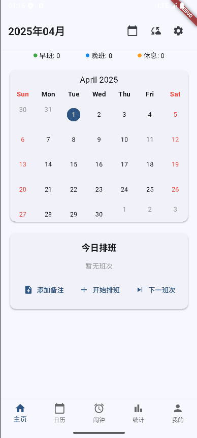
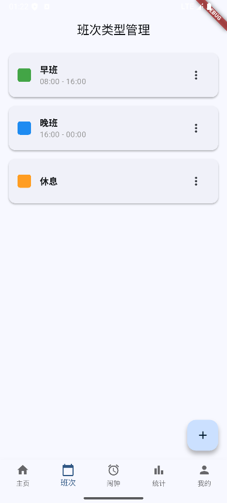
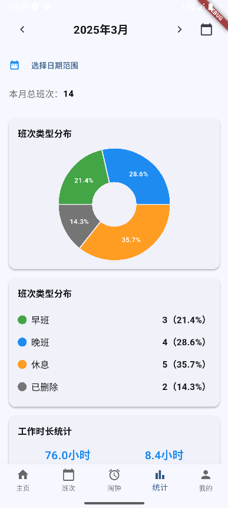
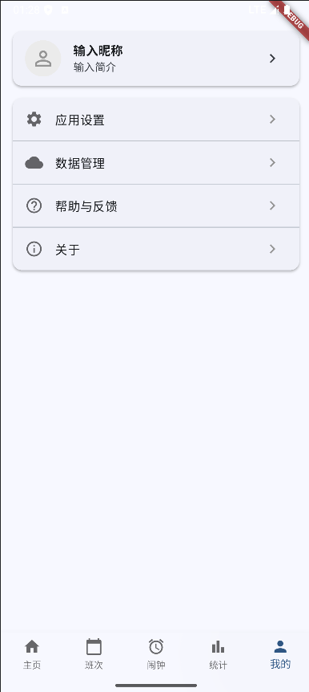

# 排班助手 (Scheduling Assistant)

<p align="center">
  <!-- 在此处放置应用logo -->
  
</p>

<p align="center">
  <a href="#功能特点">功能特点</a> •
  <a href="#应用截图">应用截图</a> •
  <a href="#技术架构">技术架构</a> •
  <a href="#项目结构">项目结构</a> •
  <a href="#安装使用">安装使用</a> •
  <a href="#开发团队">开发团队</a> •
  <a href="#未来计划">未来计划</a>
</p>

## 项目简介

排班助手是一款专为需要倒班工作的人员设计的应用程序。通过直观的界面和强大的功能，帮助用户轻松管理排班计划、设置提醒、查看统计数据，让工作生活更加有序。

特别适合医护人员、工厂工人、安保人员等需要轮班制工作的群体。

## 功能特点

### 📅 排班管理
- 多种预设班次类型（早班、晚班、休息等）
- 自定义班次类型，支持设置颜色、时间段
- 灵活添加日常排班，支持添加备注
- 轻松查看月度排班表

### ⏰ 闹钟提醒
- 根据排班自动设置闹钟提醒
- 支持提前通知，确保不会错过工作
- 闹钟设置灵活可控

### 📊 数据统计
- 直观展示工作时长、班次分布
- 月度统计分析，帮助了解工作情况
- 自动计算加班时长、工作频率

### 💾 数据备份
- 支持导出备份数据
- 一键恢复数据，换机无忧

### 🌙 暗色模式
- 支持亮色/暗色主题切换
- 保护夜间使用时的视力健康

## 应用截图

<p align="center">
  <!-- 放置应用截图 -->
  
  
  
  
</p>

## 技术架构

排班助手采用现代化的移动应用架构设计，确保代码质量和性能：

- **开发框架**: Flutter 3.x，实现跨平台应用开发
- **编程语言**: Dart
- **状态管理**: BLoC模式，实现UI和业务逻辑分离
- **数据持久化**: SQLite，高效本地数据存储
- **架构模式**: 采用分层架构（表现层、领域层、数据层、核心层）
- **依赖注入**: 使用GetIt实现服务定位
- **国际化**: 支持中英文切换

技术特点：
- 遵循SOLID设计原则，代码可维护性高
- 使用命令模式、仓库模式等设计模式提高代码质量
- 良好的错误处理机制，提升应用稳定性

## 项目结构

```
lib/
  ├── core/            # 核心工具和服务
  │   ├── di/          # 依赖注入
  │   ├── localization/ # 国际化
  │   └── utils/       # 工具类
  ├── data/            # 数据层
  │   ├── models/      # 数据模型
  │   └── repositories/ # 数据仓库
  ├── domain/          # 领域层
  │   └── services/    # 业务服务
  ├── presentation/    # 表现层
  │   ├── blocs/       # 状态管理
  │   ├── pages/       # 页面
  │   └── widgets/     # 可复用组件
  └── main.dart        # 应用入口
```

## 安装使用

### 系统要求
- Android 5.0 或更高版本
- iOS 11.0 或更高版本 (开发中)

### 安装方法

1. 从应用商店下载
   - [Google Play Store](https://play.google.com/store) (即将上线)
   - [App Store](https://www.apple.com/app-store/) (开发中)

2. 通过APK安装 (Android)
   - 下载最新版本的APK文件
   - 允许来自未知来源的应用安装
   - 点击APK文件进行安装

### 开发环境设置

如果您想参与开发或自行编译：

```bash
# 克隆项目
git clone https://github.com/xiaolin0429/SchedulingAssistant-flutter.git

# 进入项目目录
cd SchedulingAssistant-flutter

# 安装依赖
flutter pub get

# 运行应用
flutter run
```

## 开发团队

排班助手是一个开源项目，欢迎贡献代码和提出建议：

- 设计与开发：[xiaolin0429](https://github.com/xiaolin0429)
- 贡献者：期待您的参与

## 未来计划

我们计划在未来版本中添加以下功能：

- [ ] 实现与系统日历的同步，自动将排班信息添加到系统日历中
- [ ] 实现数据云同步，多设备数据共享
- [ ] 添加团队排班功能，适合小团队使用
- [ ] 优化统计分析图表，提供更多洞察
- [ ] 添加智能排班建议功能

## 反馈与支持

如有问题或建议，请通过以下方式联系我们：

- [提交Issue](https://github.com/xiaolin0429/SchedulingAssistant-flutter/issues)
- 发送邮件至：yulin0429@foxmail.com

---

<p align="center">
  使用 ❤️ 和 Flutter 制作
</p>
